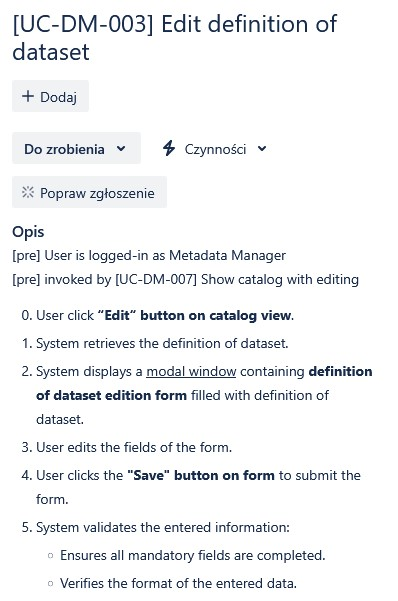
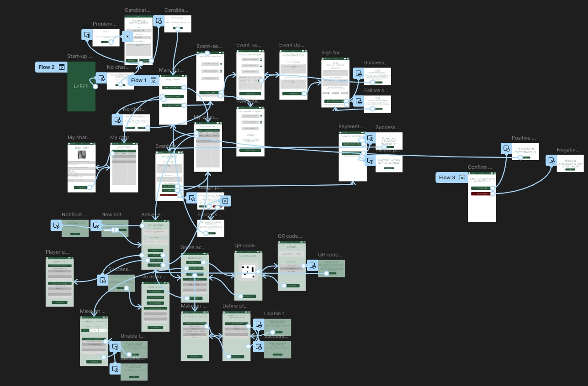

# DPWO Studium Procesu Wytwórczego

*February 2025*

## Spis treści
- [Wprowadzenie](#wprowadzenie)
- [Organizacja Pracy](#organizacja-pracy)
- [Narzędzia](#narzędzia)
- [Analiza Systemowa](#analiza-systemowa)
  - [Supplementary Specifications (Specyfikacja Uzupełniająca)](#supplementary-specifications-specyfikacja-uzupełniająca)
  - [Glossary (Słownik)](#glossary-słownik)
  - [Requirements Specification (Specyfikacja Wymagań)](#requirements-specification-specyfikacja-wymagań)
- [Architektura](#architektura)
  - [Wzorce projektowe](#wzorce-projektowe)
  - [Przebieg fazy analizy US](#przebieg-fazy-analizy-us)
  - [Diagramy](#diagramy)
- [Bazy Danych](#bazy-danych)
- [UI-UX](#ui-ux)
  - [Etapy tworzenia prototypu UI](#etapy-tworzenia-prototypu-ui)
  - [Wytyczne projektowania UI](#wytyczne-projektowania-ui)
- [Frontend](#frontend)
  - [Etapy](#etapy)
  - [Wytyczne do implementacji](#wytyczne-do-implementacji)
- [Backend](#backend)
  - [Etapy tworzenia komponentów](#etapy-tworzenia-komponentów)
  - [Wytyczne projektowania komponentów](#wytyczne-projektowania-komponentów)
  - [Dokumentacja i wdrożenie](#dokumentacja-i-wdrożenie)
- [Testy](#testy)
  - [Test Script (scenariusz testowy)](#test-script-scenariusz-testowy)
  - [Test Suite (zestaw testów)](#test-suite-zestaw-testów)
  - [Test Log (dziennik testów)](#test-log-dziennik-testów)
  - [Żądania zmian](#żądanía-zmian)
- [Code Review](#code-review)
  - [Cele](#cele)
  - [Kryteria oceny kodu](#kryteria-oceny-kodu)
  - [Przebieg Code Review](#przebieg-code-review)

## Wprowadzenie

Dokument stanowi studium procesu wytwórczego, opisujące kluczowe etapy, metody oraz narzędzia wykorzystywane w realizacji projektu. Zawiera wytyczne dotyczące tworzenia produktów pracy, wzbogacone o przykłady i wzorce ułatwiające ich opracowanie.

## Organizacja Pracy

Praca będzie prowadzona w 3-tygodniowych iteracjach z wykorzystaniem następujących zasad:
- Zarządzanie statusem i postępem prac w systemie Jira
- Każda funkcjonalność jako osobne User Story (US) z podzadaniami dla:
  - Analizy
  - Architektury
  - UI/UX
  - Frontendu
  - Backendu
  - Testów
- Bezpośrednie powiadamianie kolejnych wykonawców przez Discord po zakończeniu etapu

## Narzędzia

- **Project Management**: Jira, Confluence
- **UI/UX Design**: Figma
- **Frontend**: React
- **Backend**: Java, Spring Boot
- **Baza Danych**: MongoDB, MongoDB Compass
- **Testowanie**: JUnit, Selenium, Mockaroo
- **Version Control**:
  - Git, GitHub (centralna organizacja projektu)
  - Dwa dedykowane repozytoria:
    - Frontend
    - Backend
- **CI/CD**:
  - GitHub Actions (integracja z repozytoriami)
  - Amazon EC2 (docelowa infrastruktura deploymentu)
  - Automatyzacja testów i procesu wdrażania
- **Diagramy**: Enterprise Architect, Lucidchart

## Analiza Systemowa

W poniższej części dokumentu opisane zostanę kluczowe produkty, które precyzują zarówno funkcjonalne, jak i niefunkcjonalne aspekty systemu, stanowiąc podstawę do dalszych etapów projektowania i implementacji.

**Zbieranie wymagań**
- Wywiady
- Warsztaty
- Analiza dokumentacji

**Zarządzanie wymaganiami**
- Do przechowywania i zarządzania wymaganiami wykorzystane zostanie oprogramowanie Jira. Będą one opisywane za pośrednictwem przypadków użycia. Każdy przypadek użycia posiada swój numer id, nazwę oraz opis w postaci scenariusza.



- W ramach śledzenia wymagań oraz postępów projktu, wykorzystane zostaną rozmaite narzędzia oferowane przez oprogramowanie Jira oraz Confluence:
  - Tablica Kanban (Jira) - Całościowe śledzenie postępu realizacji wymagań. Podział według statusu zadań (Do zrobienia, W toku, Code Review, Gotowe).
  - Stories (Jira) - Szczegółowy opis poszczególnych przypadków użycia oraz powiązanych z nimi scenariuszy.
  - Szablon wywiadów Q&A (Confluence) - Narzędzie wspomagające przeprowadzanie wywiadów z klientem i tworzenia notatek on-line.
  - Szablon słownika (Confluence) - Narzędzie do tworzenia wersji słownika opisującego niejednoznaczne zagadnienia biznesowe.

**Priorytetyzacja oraz szacowanie pracochłonności wymagań**
- Ocena ważności wymagań realizowana będzie zgodnie z podejściem MoSCoW (must, should, could, won't).
- Przypisanie odpowiednich etykiet priorytetów w Jirze.
- Czasochłonność określana w MD (man-day) przy pomocy Scrum Poker'a.

**Wykorzystywane narzędzia**
- Jira - przechowywanie i zarządzanie wymaganiami przy pomocy tablicy Kanban oraz Stories.
- Confluence - tworzenie słownika opisowego oraz zapisu wywiadu Q&A.
- Lucidchart - tworzenie słownika w postaci diagramu klas.

### Supplementary Specifications (Specyfikacja Uzupełniająca)

**Wymagania jakościowe**
- Wydajność - określenie maksymalnego czasu odpowiedzi systemu, liczby obsługiwanych użytkowników
- Dostępność - zapewnienie wysokiej dostępności systemu (SLA)
- Bezpieczeństwo – zabezpieczenia przed atakami, autoryzacja, szyfrowanie danych
- Zgodność z regulacjami prawnymi - wymagania prawne i branżowe (np. RODO)
- Zgodność ze standardami (np. DCAT-AP)

Wszystkie wymagania niefunkcjonalne zostaną spisane w dokumencie **Specyfikacja Uzupełniająca**, który będzie jednym z produktów analizy systemowej. Dokument ten będzie podstawą do testowania i walidacji systemu w kontekście spełnienia założeń jakościowych, zgodnie z przedstawionymi w nim metrykami.

### Glossary (Słownik)

**Definiowanie kluczowych terminów oraz definicji domenowych**
- Opis podstawowych pojęć oraz skrótów i akronimów używanych w projekcie
- Opis zrealizowany zostanie za pośrednictwem diagramów klas oraz osobnego dokumentu uwzględniającego definicje konkretnych haseł
- Przykłady pojęć zawieranych w słowniku: API (Application Programming Interface), SLA (Service Level Agreement), Metadane

### Requirements Specification (Specyfikacja Wymagań)

Każdy przypadek użycia został opisany poprzez:
- unikalny identyfikator (np. **UC-DM-002**)
- priorytet według schematu MoSCoW (M-1 – krytyczne, S-2 – średnie, C-3 – niskie, W-4 – bardzo niskie)
- opis interakcji użytkownika z systemem

Przypadki użycia przedstawione są w formie diagramów oraz scenariuszy. Specyfikacja ta umożliwia przeprowadzenie implementacji zgodnie z określonymi wymaganiami funkcjonalnymi oraz zapewnia podstawę do testowania poprawności działania systemu.

## Architektura

### Wzorce projektowe

Oprogramowanie wytwarzane będzie zgodnie ze wzorcem Model-View-Controller (MVC), co zapewni jego modułowość, przejrzystość oraz łatwość utrzymania i rozwoju.

- **Modele** – Odpowiadają za logikę biznesową i operacje na danych
- **Widoki** – Odpowiadają za prezentację danych użytkownikowi
- **Kontrolery** – Odpowiadają za pośredniczenie między Widokami a Modelami, obsługując interakcje użytkownika

W ramach technologii stosowanych w projekcie:
- Frontend zostanie zaimplementowany w React, co umożliwi tworzenie dynamicznych i responsywnych interfejsów użytkownika
- Backend będzie oparty na języku Java z wykorzystaniem nowoczesnych frameworków, takich jak Spring Boot, zapewniających wysoką wydajność i łatwość integracji
- Baza danych będzie przechowywana w MongoDB, co umożliwi elastyczne zarządzanie danymi w formacie dokumentowym
- Komunikacja między frontendem a backendem odbywać się będzie poprzez REST API, co zapewni skalowalność i łatwość integracji z innymi systemami

### Przebieg fazy analizy US

- Analiza architektoniczna przypadków użycia – określenie przynależności przypadków użycia do poszczególnych komponentów systemu oraz ich roli w architekturze
- Opracowanie planu implementacji – identyfikacja kolejności wdrażania poszczególnych przypadków użycia zgodnie z priorytetami biznesowymi i technicznymi
- Definicja struktury kodu – określenie hierarchii klas, metod oraz pól w zgodzie z zasadami projektowania obiektowego oraz wzorcem MVC
- Określenie protokołu komunikacji – specyfikacja punktów końcowych API (endpoints), formatów przesyłanych danych oraz metod komunikacji pomiędzy frontendem a backendem
- Tworzenie diagramów architektonicznych – wizualizacja struktury systemu za pomocą diagramów UML, w tym diagramów przypadków użycia, diagramów klas oraz diagramów sekwencji

### Diagramy

W wyniku analizy architektonicznej będą tworzone następujące diagramy:
- **Diagram klas** – przedstawia strukturę systemu, pokazując klasy oraz ich wzajemne relacje
- **Diagram komponentów** – ilustruje fizyczną strukturę systemu, pokazując poszczególne komponenty i ich zależności
- **Diagram sekwencji** – opisuje interakcje pomiędzy obiektami w systemie w ramach określonego scenariusza

## Bazy Danych

W ramach stworzenia systemu projektanci bazy danych odpowiadają za zaprojektowanie, utworzenie oraz optymalizację struktury bazy danych. W projekcie zdecydowano się na wykorzystanie systemu zarządzania bazami danych MongoDB oraz dokumentów JSON jako formy projektu struktury dokumentów.

**Przykład dokumentu data_schema:**
```json
{
    "_id": {
        "$oid": "67c75aab6b0968ffa0850188"
    },
    "name": "sample schema",
    "elements": [{
            "name": "pole1",
            "type": "string"
        }, {
            "name": "pole2",
            "type": "int"
        }
    ]
}```
## Etapy pracy, którą będą wykonywać projektanci:

1. **Zdefiniowanie diagramu bazy danych** – analiza wymagań systemu; przedstawienie struktury bazy danych w graficznej formie; określenie kluczy głównych, obcych, relacji.
2. **Stworzenie bazy danych MongoDB** – utworzenie klastra w MongoDB Atlas w celu zapewnienia dostępu do bazy wszystkim członkom projektu.
3. **Ewentualne poprawki i udoskonalenia** – testowanie bazy danych pod kątem poprawności działania oraz wydajności i wprowadzanie odpowiednich modyfikacji na podstawie wyników.

# UI-UX

### Etapy tworzenia prototypu UI

#### **Analiza wymagań**
- Zrozumienie celów projektu, grupy docelowej oraz kluczowych funkcji.

#### **Tworzenie wireframe’ów**
- Szkice niskiej jakości (low-fidelity) przedstawiające strukturę strony lub aplikacji.
- Narzędzie: Figma.

#### **Projektowanie interaktywnych makiet (high-fidelity prototype)**
- Opracowanie realistycznych widoków z uwzględnieniem kolorystyki, typografii i komponentów UI.
- Dodanie interakcji i animacji do symulacji doświadczenia użytkownika.
- Testowanie użyteczności poprzez zbieranie feedbacku od użytkowników.

#### **Weryfikacja i iteracja**
- Współpraca z deweloperami w celu zapewnienia zgodności z technologią.



### Wytyczne projektowania UI

#### **Cel**  
UI Guidelines to zestaw zasad i wytycznych określających wygląd i zachowanie interfejsu użytkownika, aby zapewnić spójność i intuicyjność produktu.

#### **Elementy wytycznych UI**

**Typografia**
- Określenie rodziny fontów, hierarchii nagłówków i stylów tekstu.
- Przykład: Nagłówki - Roboto Bold 24px, Tekst podstawowy - Roboto Regular 16px.

**Kolorystyka**
- Definiowanie podstawowej palety kolorów, ich zastosowań oraz wariantów.
- Przykład: Kolor główny `#007BFF`, kolor akcentowy `#FF5733`, kolor tła `#F5F5F5`.

**Komponenty UI**
- Przyciski, formularze, karty, modalne okna, ikony, powiadomienia.
- Specyfikacja stanów (np. hover, active, disabled).

**Siatka i układ**
- Określenie grid systemu (np. 12-kolumnowa siatka, odstępy między elementami).

#### **Dokumentacja i wdrożenie**
- Stworzenie centralnego repozytorium wytycznych (w Figmie).
- Regularne aktualizowanie na podstawie nowych wymagań projektowych i technologicznych.
- Współpraca z zespołem deweloperskim przy wdrażaniu wytycznych w systemach design systemu (np. Material UI, Bootstrap, Tailwind).

# Frontend

## Etapy

### **Implementacja komponentu**
- Analiza oraz rozdzielenie fragmentów UI z makiet na komponenty.
- Implementacja wydzielonych komponentów z użyciem zaślepek.
- Integracja komponentów z backendem.

### **Implementacja komponentów testujących**
- Wyznaczenie miejsc wymagających testowania.
- Implementacja testów jednostkowych.
- Uruchomienie testów jednostkowych.
- Wygenerowanie raportu z testów.

### **Wykonanie instrukcji instalacji**
- Przedstawienie potrzebnych narzędzi do uruchomienia projektu.
- Opisanie konfiguracji środowiska.
- Opis uruchomienia aplikacji (lista komend).

### **Naprawianie błędów**
- Współpraca z testerami poprzez rozwiązywanie zgłaszanych problemów w JIRA.
- Implementacja poprawek.

### **Zgłaszanie uwag innym zespołom w trakcie pracy nad systemem**

## Wytyczne do implementacji

### **Technologia i narzędzia**
- Wykorzystanie biblioteki React do budowy GUI.
- Przyspieszenie prac integracyjnych z backendem poprzez wykorzystanie mocków oraz danych generowanych przy pomocy Mockaroo.
- Wykorzystanie npm do budowy i automatyzacji.

### **Struktura kodu i modularność**
- Projektowanie komponentów UI, które są od siebie niezależne i możliwe do wielokrotnego użytku.
- Organizacja kodu zgodnie z przyjętymi wzorcami projektowymi oraz czystą architekturą.
- Stosowanie się do zasad **DRY, KISS oraz Clean Code**.
- Spójne nazewnictwo metod (`camelCase`), plików (`PascalCase`) oraz pakietów (`PascalCase`).

### **Responsywność i dostępność**
- Projektowanie interfejsów responsywnych, dostosowanych do różnych urządzeń i rozdzielczości ekranu.
# Backend

## Etapy tworzenia komponentów

### **Implementacja**
- Tworzenie API i logiki biznesowej.

### **Testowanie**
- Tworzenie testów jednostkowych.

### **Wdrożenie i utrzymanie**
- Przegląd kodu przez zespół.
- Współpraca z frontendem w celu zapewnienia poprawnej integracji API.
- Optymalizacja wydajności i poprawki na podstawie feedbacku.

## Wytyczne projektowania komponentów

### **Styl kodowania i konwencje**
- Stosowanie zasad **DRY, KISS oraz Clean Code**.
- Konsekwentne nazewnictwo metod, klas i zmiennych (np. `getUserById()`, `calculateTotalPrice()`).

### **Bezpieczeństwo**
- Stosowanie autoryzacji i uwierzytelniania (**OAuth2, JWT**).
- Walidacja danych wejściowych i ochrona przed atakami (**SQL Injection, XSS**).

### **Testowanie i jakość kodu**
- Pokrycie kodu testami jednostkowymi (**JUnit, Spock**).

## Dokumentacja i wdrożenie
- Stworzenie centralnego repozytorium (**GitHub**).
- Regularne aktualizowanie na podstawie nowych wymagań projektowych.

---

# Testy

## **Test Script (scenariusz testowy)**
Produktem pracy jest dokument zawierający sekwencję kroków podjętych w ramach testów wraz z zawarciem niezbędnych informacji. 

### **Elementy scenariusza testowego**
- Warunki wstępne testu (np. użytkownik jest zalogowany).
- Lista działań podjętych w ramach testu.
- Oczekiwany efekt każdego kroku.
- Warunki końcowe, czyli stan systemu po zakończeniu testu.

### **Przykładowy scenariusz testowy**

**Przypadek testowy: Edytowanie schematu danych**  
**Test Case ID:** TC-SM-004  
**Use Case ID:** UC-SM-004  
**Opis:**  
Weryfikacja, czy użytkownik jest w stanie edytować istniejący schemat danych korzystając z ekranu edycji schematu danych i formularza edycji.

**Warunki wstępne:**
- Użytkownik jest zalogowany do systemu.
- Schemat danych istnieje w systemie.
- Użytkownik dysponuje uprawnieniami do edycji schematu.

| Krok | Opis | Oczekiwany efekt |
|------|------|-----------------|
| 1 | Przejście do ekranu „Schematy Danych” | System wyświetla obecne w systemie schematy danych. |
| 2 | Wybór schematu z listy do edycji | System ładuje ekran „Edycja Schematu”, widoczne są aktualne dane schematu i formularz edycji schematu. |
| 3 | Modyfikacja pól formularza (np. nazwy, typów danych) | Formularz akceptuje wprowadzone wartości. |
| 4 | Kliknięcie przycisku „Zapisz” | System waliduje wprowadzone wartości i zapisuje zmiany. |
| 5 | Weryfikacja, czy system potwierdził edycję | Widoczny jest pop-up z informacją „Schemat edytowany pomyślnie”. |
| 6 | Odświeżenie listy schematów | System wyświetla listę schematów z uwzględnionymi zmianami. |

**Warunki końcowe:**
- Schemat został edytowany i zapisany w systemie.
- Zmiany utrzymują się po odświeżeniu okna.

**Dane testowe:**

| Field | Old Value | New Value |
|-------|----------|----------|
| Schema Name | CustomerData | CustomerInfo |
| Data Type | VARCHAR(50) | VARCHAR(100) |

---

## **Test Suite (zestaw testów)**
Zestaw testów stanowi kolekcję skryptów testowych. Test suite może zawierać zarówno testy automatyczne, jak i manualne.  
Zestaw będzie zorganizowany hierarchicznie dla łatwego zarządzania testami i efektywnej realizacji, w tym z możliwością ponownego wykorzystania skryptów.

---

## **Test Log (dziennik testów)**
Dziennik testów to zbiór nieprzetworzonych wyników testów. Pochodzą one z niezależnego wykonania jednego lub wielu testów zdefiniowanych w zestawie testów.  
Wyniki jednego testu zapisywane są w formie tabeli, której przykład zaprezentowano poniżej.

| Krok | Opis kroku | Status | Wynik |
|------|-----------|--------|-------|
| 1 | Open login page | Pass | Page loaded successfully |
| 2 | Enter credentials | Pass | Input accepted |
| 3 | Click login | Fail | "Invalid password" error displayed |

---

## **Żądania zmian**
Dokument wykorzystywany do zgłaszania, śledzenia i zarządzania zmianami w produkcie, w tym poprawkami defektów, propozycjami ulepszeń oraz innymi modyfikacjami odkrytymi w trakcie testów.  
Żądanie zmian będzie się odbywało za pośrednictwem systemu **Jira** w postaci odpowiednich rodzajów zgłoszeń.  

Poza podstawowymi danymi zgłoszeń Jira, żądanie zmiany powinno zawierać:
- Kroki do odtworzenia (jeśli dotyczy).
- Opis zachowania systemu **AS-IS** i **TO-BE**.
# Code Review

## Cele
- Poprawa czytelności i utrzymania kodu.
- Identyfikacja błędów i potencjalnych problemów.
- Zapewnienie zgodności ze standardami kodowania i architekturą systemu.
- Optymalizacja wydajności i bezpieczeństwa.

---

## Kryteria oceny kodu

### **Czytelność i styl kodu**
- Czy kod jest zrozumiały i dobrze zorganizowany?
- Czy stosuje konwencje nazewnicze zgodne ze standardem projektu?
- Czy formatowanie kodu (np. wcięcia, odstępy) jest spójne?

### **Struktura i organizacja**
- Czy kod jest podzielony na logiczne moduły i funkcje?
- Czy każda funkcja/metoda spełnia tylko jedno zadanie (**Single Responsibility Principle – SRP**)?
- Czy unika się zduplikowanego kodu (**DRY – Don't Repeat Yourself**)?

### **Poprawność i funkcjonalność**
- Czy kod realizuje zamierzony cel zgodnie z wymaganiami?
- Czy obsługuje różne przypadki brzegowe?
- Czy nie ma błędów logicznych lub potencjalnych awarii?

### **Optymalizacja i wydajność**
- Czy kod działa efektywnie i nie obciąża niepotrzebnie zasobów?
- Czy można poprawić jego wydajność, np. zmniejszając złożoność obliczeniową?
- Czy zapytania do bazy danych są zoptymalizowane (np. indeksy, paginacja)?

### **Bezpieczeństwo**
- Czy kod jest odporny na ataki (np. **SQL Injection, XSS, CSRF**)?
- Czy dane użytkowników są prawidłowo przechowywane i szyfrowane?
- Czy unika się przechowywania wrażliwych danych w kodzie źródłowym?

### **Testy i pokrycie kodu**
- Czy istnieją testy jednostkowe i integracyjne?
- Czy pokrycie kodu testami jest wystarczające?
- Czy testy sprawdzają kluczowe przypadki użycia i warunki brzegowe?

### **Zgodność z architekturą i wymaganiami projektu**
- Czy kod jest zgodny z założeniami architektonicznymi projektu?
- Czy używane są właściwe wzorce projektowe?
- Czy integracja z innymi komponentami systemu jest poprawna?

---

## Przebieg Code Review

### **Przygotowanie**
- Zapoznanie się z kontekstem zmiany (**PR, opis zadania, dokumentacja**).
- Sprawdzenie, czy zmiana jest zgodna z wymaganiami biznesowymi i technicznymi.

### **Analiza kodu**
- Przejrzenie kodu zgodnie z wyżej wymienionymi kryteriami.
- Zwrócenie uwagi na potencjalne błędy i nieefektywności.

### **Komentowanie i feedback**
- Przekazanie konstruktywnych uwag z jasnymi sugestiami poprawy.
- Wskazanie dobrych praktyk i możliwych ulepszeń.
- Unikanie subiektywnej krytyki – skupienie się na jakości kodu.

### **Dyskusja i iteracja**
- Omówienie uwag z autorem kodu.
- Wprowadzenie niezbędnych poprawek.
- Finalna akceptacja i zatwierdzenie kodu.


