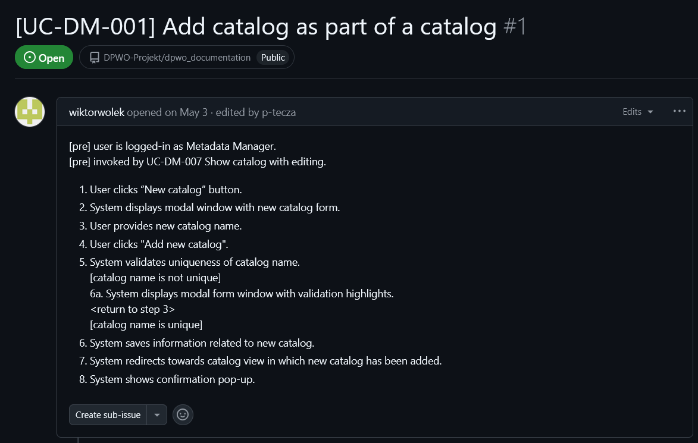
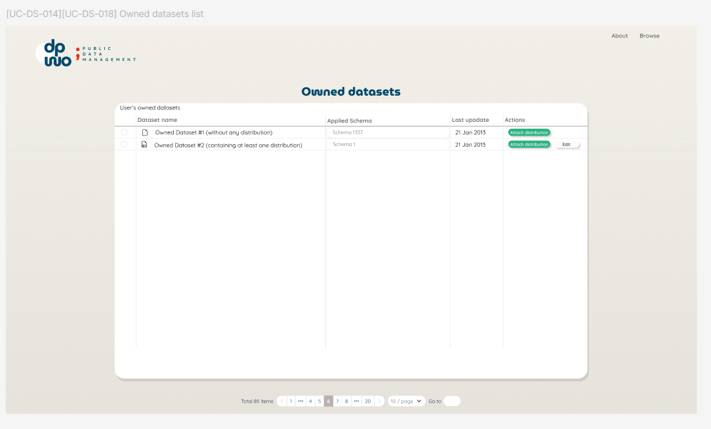
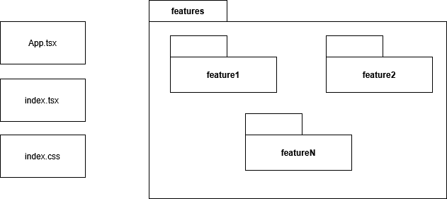

# DPWO Studium Procesu Wytwórczego

*February 2025*

## Spis treści
- [DPWO Studium Procesu Wytwórczego](#dpwo-studium-procesu-wytwórczego)
  - [Spis treści](#spis-treści)
  - [Wprowadzenie](#wprowadzenie)
  - [Organizacja Pracy](#organizacja-pracy)
  - [Narzędzia](#narzędzia)
  - [Analiza Systemowa](#analiza-systemowa)
    - [Kluczowe artefakty analizy systemowej](#kluczowe-artefakty-analizy-systemowej)
      - [Glossary (Słownik)](#glossary-słownik)
      - [Requirements Specification (Specyfikacja Wymagań)](#requirements-specification-specyfikacja-wymagań)
  - [Architektura](#architektura)
    - [Wzorce projektowe](#wzorce-projektowe)
    - [Przebieg fazy analizy US](#przebieg-fazy-analizy-us)
    - [Diagramy](#diagramy)
  - [Bazy Danych](#bazy-danych)
  - [Etapy pracy, którą będą wykonywać projektanci:](#etapy-pracy-którą-będą-wykonywać-projektanci)
- [UI-UX](#ui-ux)
    - [Etapy tworzenia prototypu UI](#etapy-tworzenia-prototypu-ui)
      - [**Analiza wymagań**](#analiza-wymagań)
      - [**Tworzenie wireframe’ów**](#tworzenie-wireframeów)
      - [**Projektowanie interaktywnych makiet (high-fidelity prototype)**](#projektowanie-interaktywnych-makiet-high-fidelity-prototype)
      - [**Weryfikacja i iteracja**](#weryfikacja-i-iteracja)
    - [Wytyczne projektowania UI](#wytyczne-projektowania-ui)
      - [**Cel**](#cel)
      - [**Elementy wytycznych UI**](#elementy-wytycznych-ui)
      - [**Dokumentacja i wdrożenie**](#dokumentacja-i-wdrożenie)
- [Frontend](#frontend)
  - [Etapy](#etapy)
    - [**Implementacja komponentu**](#implementacja-komponentu)
    - [**Implementacja komponentów testujących**](#implementacja-komponentów-testujących)
    - [**Wykonanie instrukcji instalacji**](#wykonanie-instrukcji-instalacji)
    - [**Naprawianie błędów**](#naprawianie-błędów)
    - [**Zgłaszanie uwag innym zespołom w trakcie pracy nad systemem**](#zgłaszanie-uwag-innym-zespołom-w-trakcie-pracy-nad-systemem)
  - [Wytyczne do implementacji](#wytyczne-do-implementacji)
    - [Technologia i narzędzia](#technologia-i-narzędzia)
    - [Struktura kodu i modularność](#struktura-kodu-i-modularność)
    - [Dobre praktyki kodowania](#dobre-praktyki-kodowania)
    - [Responsywność i dostępność](#responsywność-i-dostępność)
- [Backend](#backend)
  - [Etapy tworzenia komponentów](#etapy-tworzenia-komponentów)
    - [**Implementacja**](#implementacja)
    - [**Testowanie**](#testowanie)
    - [**Wdrożenie i utrzymanie**](#wdrożenie-i-utrzymanie)
  - [Wytyczne projektowania komponentów](#wytyczne-projektowania-komponentów)
    - [**Styl kodowania i konwencje**](#styl-kodowania-i-konwencje)
    - [**Bezpieczeństwo**](#bezpieczeństwo)
    - [**Testowanie i jakość kodu**](#testowanie-i-jakość-kodu)
  - [Dokumentacja i wdrożenie](#dokumentacja-i-wdrożenie-1)
- [Testy](#testy)
  - [**Test Script (scenariusz testowy)**](#test-script-scenariusz-testowy)
    - [**Elementy scenariusza testowego**](#elementy-scenariusza-testowego)
    - [**Przykładowy scenariusz testowy**](#przykładowy-scenariusz-testowy)
  - [\[TS-03-DM-007\] Optional title](#ts-03-dm-007-optional-title)
  - [**Test Suite (zestaw testów)**](#test-suite-zestaw-testów)
  - [**Test Log (dziennik testów)**](#test-log-dziennik-testów)
  - [**Test Plan (scenariusz testów)**](#test-plan-scenariusz-testów)
- [Test Plan 05 - datasets with schemas](#test-plan-05---datasets-with-schemas)
  - [Test plan steps:](#test-plan-steps)
    - [1. TC-03-DS-014 Opening Owned Datasets Catalog when user is not logged in](#1-tc-03-ds-014-opening-owned-datasets-catalog-when-user-is-not-logged-in)
    - [2. TS-01-TS-001 Sucessfull user registration as Data Supplier](#2-ts-01-ts-001-sucessfull-user-registration-as-data-supplier)
    - [3. TC-01-DS-014 Opening Owned Datasets Catalog when no dataset is available](#3-tc-01-ds-014-opening-owned-datasets-catalog-when-no-dataset-is-available)
    - [4. TS-01-DM-002 Successfully add dataset](#4-ts-01-dm-002-successfully-add-dataset)
    - [5. TC-02-DS-014 Opening Owned Datasets Catalog when no dataset is available](#5-tc-02-ds-014-opening-owned-datasets-catalog-when-no-dataset-is-available)
  - [**Żądania zmian**](#żądania-zmian)
- [Code Review](#code-review)
  - [Cele](#cele)
  - [Kryteria oceny kodu](#kryteria-oceny-kodu)
    - [**Czytelność i styl kodu**](#czytelność-i-styl-kodu)
    - [**Struktura i organizacja**](#struktura-i-organizacja)
    - [**Poprawność i funkcjonalność**](#poprawność-i-funkcjonalność)
    - [**Optymalizacja i wydajność**](#optymalizacja-i-wydajność)
    - [**Bezpieczeństwo**](#bezpieczeństwo-1)
    - [**Testy i pokrycie kodu**](#testy-i-pokrycie-kodu)
    - [**Zgodność z architekturą i wymaganiami projektu**](#zgodność-z-architekturą-i-wymaganiami-projektu)
  - [Przebieg Code Review](#przebieg-code-review)
    - [**Przygotowanie**](#przygotowanie)
    - [**Analiza kodu**](#analiza-kodu)
    - [**Komentowanie i feedback**](#komentowanie-i-feedback)
    - [**Dyskusja i iteracja**](#dyskusja-i-iteracja)

## Wprowadzenie

Dokument stanowi studium procesu wytwórczego, opisujące kluczowe etapy, metody oraz narzędzia wykorzystywane w realizacji projektu. Zawiera wytyczne dotyczące tworzenia produktów pracy, wzbogacone o przykłady i wzorce ułatwiające ich opracowanie.

## Organizacja Pracy

Praca będzie prowadzona w 3-tygodniowych iteracjach z wykorzystaniem następujących zasad:
- Zarządzanie statusem i postępem prac w systemie GitHub Boards
- Każda funkcjonalność jako osobne zadanie.
- Bezpośrednie powiadamianie kolejnych wykonawców przez Discord po zakończeniu etapu

## Narzędzia

- **Project Management**: GitHub Boards
- **UI/UX Design**: Figma
- **Frontend**: React
- **Backend**: Java, Spring Boot
- **Baza Danych**: MongoDB, MongoDB Compass
- **Version Control**:
  - Git, GitHub (centralna organizacja projektu)
  - Dwa dedykowane repozytoria:
    - Frontend
    - Backend
- **CI/CD**:
  - GitHub Actions (integracja z repozytoriami)
  - Amazon EC2 (docelowa infrastruktura deploymentu)
  - Automatyzacja testów i procesu wdrażania
- **Diagramy**: Lucidchart

## Analiza Systemowa

W poniższej części dokumentu opisane zostanę kluczowe produkty, które precyzują zarówno funkcjonalne, jak i niefunkcjonalne aspekty systemu, stanowiąc podstawę do dalszych etapów projektowania i implementacji.

**Zbieranie wymagań**
- Wywiady
- Warsztaty
- Analiza dokumentacji

**Zarządzanie wymaganiami**
- Do przechowywania i zarządzania wymaganiami wykorzystywane będzie oprogramowanie GitHub Projects.
- Podstawowym źródłem funkcjonalności systemu są diagramy przypadków użycia.
- Wymagania będą opisywane za pomocą Zagadnień (Issues), które zostaną przypisane bezpośrednio do odpowiednich przypadków użycia.
- Każde zagadnienie rozpatrywane w ramach projektu powinno zostać umieszczone w Backlogu, opatrzone stosownym identyfikatorem oraz nazwą odpowiadającego mu przypadku użycia (PU). Dodatkowo, w opisie każdego zagadnienia zamieszczane będą scenariusze przypadków użycia.
- Identyfikatory przypadków użycia konstruowane powinny być zgodnie z formułą: UC-\[identyfikator_diagramu_PU\]-\[nr_PU\]


*Rysunek 1: Przykładowe zagadnienie dla przypadku użycia*

- W ramach śledzenia wymagań, stanu oraz postępów projktu, wykorzystane zostaną konkretne moduły oprogramowanie GitHub, aplikacja Lucidchart oraz program Enterprise Architect:
  - Tablica Kanban (GitHub Board) - Całościowe śledzenie postępu realizacji wymagań. Podział według statusu zadań (Todo, In Progress, Done).
  - Repozytorium dokumentacji (GitHub Repository) - Repozytorium, do którego docelowo trafiać będą wszystkie powstające artefakty powiązane z dokumentacją projektu.
  - Szablon słownika (Lucidchart) - Narzędzie do tworzenia wersji słownika opisującego niejednoznaczne zagadnienia biznesowe.
  - Kreator diagramów przypadków użycia (Enterprise Architect) - Narzędzie wykorzystywane do tworzenia diagramów przypadków użycia w sytuacjach, gdy nie są one odgórnie zdefiniowane, umożliwiające ich opracowanie we współpracy z klientem.

**Definiowanie pożądanych funkcjonalności przy wykorzystaniu diagramu przypadków użycia**
- Definiowanie pożądanych funkcjonalności systemu odbywa się przy wykorzystaniu diagramu przypadków użycia. W przypadku braku wcześniej zdefiniowanych wymagań, diagram ten tworzony jest we współpracy z klientem.

**Priorytetyzacja oraz szacowanie pracochłonności wymagań**
- Ocena ważności wymagań realizowana będzie zgodnie z podejściem MoSCoW (must, should, could, won't). Ma ona miejsce podczas definiowania diagramów przypadków użycia.

### Kluczowe artefakty analizy systemowej

W ramach analizy systemowej powstaną 2 kluczowe artefakty.

### Glossary (Słownik)

**Definiowanie kluczowych definicji projektowych**
- Definiowanie istotnych zagadnień projektowych będzie mieć miejsce w formie wizualnej.
- Wizualizacja zrealizowana zostanie za pośrednictwem diagramu klas (zgodnego z normą UML), uwzględniającego obiekty dziedziny biznesowej oraz relacje między nimi.

### Requirements Specification (Specyfikacja Wymagań)

Każdy przypadek użycia został opisany poprzez:
- Unikalny identyfikator (np. **UC-DM-002**).
- Priorytet według schematu MoSCoW (M-1 – krytyczne, S-2 – średnie, C-3 – niskie, W-4 – bardzo niskie).
- Opis interakcji użytkownika z systemem.

Przypadki użycia przedstawione są w formie diagramów oraz scenariuszy. Specyfikacja ta umożliwia przeprowadzenie implementacji zgodnie z określonymi wymaganiami funkcjonalnymi oraz zapewnia podstawę do testowania poprawności działania systemu.

## Architektura

### Wzorce projektowe

Oprogramowanie wytwarzane będzie zgodnie ze wzorcem Model-View-Controller (MVC), co zapewni jego modułowość, przejrzystość oraz łatwość utrzymania i rozwoju.

- **Modele** – Odpowiadają za logikę biznesową i operacje na danych
- **Widoki** – Odpowiadają za prezentację danych użytkownikowi
- **Kontrolery** – Odpowiadają za pośredniczenie między Widokami a Modelami, obsługując interakcje użytkownika

W ramach technologii stosowanych w projekcie:
- Frontend zostanie zaimplementowany w React, co umożliwi tworzenie dynamicznych i responsywnych interfejsów użytkownika
- Backend będzie oparty na języku Java z wykorzystaniem nowoczesnych frameworków, takich jak Spring Boot, zapewniających wysoką wydajność i łatwość integracji
- Baza danych będzie przechowywana w MongoDB, co umożliwi elastyczne zarządzanie danymi w formacie dokumentowym
- Komunikacja między frontendem a backendem odbywać się będzie poprzez REST API, co zapewni skalowalność i łatwość integracji z innymi systemami

### Przebieg fazy analizy US

- Analiza architektoniczna przypadków użycia – określenie przynależności przypadków użycia do poszczególnych komponentów systemu oraz ich roli w architekturze
- Opracowanie planu implementacji – identyfikacja kolejności wdrażania poszczególnych przypadków użycia zgodnie z priorytetami biznesowymi i technicznymi
- Definicja struktury kodu – określenie hierarchii klas, metod oraz pól w zgodzie z zasadami projektowania obiektowego oraz wzorcem MVC
- Określenie protokołu komunikacji – specyfikacja punktów końcowych API (endpoints), formatów przesyłanych danych oraz metod komunikacji pomiędzy frontendem a backendem
- Tworzenie diagramów architektonicznych – wizualizacja struktury systemu za pomocą diagramów UML, w tym diagramów przypadków użycia, diagramów klas oraz diagramów sekwencji

### Diagramy

W wyniku analizy architektonicznej będą tworzone następujące diagramy:
- **Diagram klas** – przedstawia strukturę systemu, pokazując klasy oraz ich wzajemne relacje
- **Diagram komponentów** – ilustruje fizyczną strukturę systemu, pokazując poszczególne komponenty i ich zależności
- **Diagram sekwencji** – opisuje interakcje pomiędzy obiektami w systemie w ramach określonego scenariusza

## Bazy Danych

W ramach stworzenia systemu projektanci bazy danych odpowiadają za zaprojektowanie, utworzenie oraz optymalizację struktury bazy danych. W projekcie zdecydowano się na wykorzystanie systemu zarządzania bazami danych MongoDB oraz dokumentów JSON jako formy projektu struktury dokumentów.

## Etapy pracy, którą będą wykonywać projektanci:

1. **Zdefiniowanie diagramu bazy danych** – analiza wymagań systemu; przedstawienie struktury bazy danych w graficznej formie; określenie kluczy głównych, obcych, relacji.
2. **Stworzenie bazy danych MongoDB** – utworzenie klastra w MongoDB Atlas w celu zapewnienia dostępu do bazy wszystkim członkom projektu.
3. **Ewentualne poprawki i udoskonalenia** – testowanie bazy danych pod kątem poprawności działania oraz wydajności i wprowadzanie odpowiednich modyfikacji na podstawie wyników.

# UI-UX

### Etapy tworzenia prototypu UI

#### **Analiza wymagań**
- Zrozumienie celów projektu, grupy docelowej oraz kluczowych funkcji.

#### **Tworzenie wireframe’ów**
- Szkice przedstawiające strukturę strony lub aplikacji.
- Opracowanie realistycznych widoków z uwzględnieniem kolorystyki, typografii i komponentów UI.
- Narzędzie: Figma.

#### **Dodawanie opisów nawigacji warunkowej**
- Dodanie opisu symulacji zachowania użytkownika oraz wynikowej nawigacji międzywidokowej.

#### **Weryfikacja i iteracja**
- Współpraca z deweloperami w celu zapewnienia zgodności z technologią.


*Rysunek 2: Przykładowa makieta*

### Wytyczne projektowania UI

#### **Cel**  
UI Guidelines to zestaw zasad i wytycznych określających wygląd i zachowanie interfejsu użytkownika, aby zapewnić spójność i intuicyjność produktu.

#### **Elementy wytycznych UI**

**Typografia**
- Określenie rodziny fontów, hierarchii nagłówków i stylów tekstu.
- Przykład: Nagłówki - Roboto Bold 24px, Tekst podstawowy - Roboto Regular 16px.

**Kolorystyka**
- Definiowanie podstawowej palety kolorów, ich zastosowań oraz wariantów.
- Przykład: Kolor główny `#007BFF`, kolor akcentowy `#FF5733`, kolor tła `#F5F5F5`.

**Komponenty UI**
- Przyciski, formularze, karty, modalne okna, ikony, powiadomienia.
- Specyfikacja stanów (np. hover, active, disabled).

**Siatka i układ**
- Określenie grid systemu (np. 12-kolumnowa siatka, odstępy między elementami).

#### **Dokumentacja i wdrożenie**
- Stworzenie centralnego repozytorium wytycznych (w Figmie).
- Regularne aktualizowanie na podstawie nowych wymagań projektowych i technologicznych.
- Współpraca z zespołem deweloperskim przy wdrażaniu wytycznych w systemach design systemu (np. Material UI, Bootstrap, Tailwind).

# Frontend

## Etapy

### Planowanie
- Analiza oraz rozdzielenie fragmentów UI z makiet na komponenty.
- Przypisanie zadań w sprincie do poszczególnych programistów.

### Implementacja komponentu
- Implementacja wydzielonych komponentów z użyciem zaślepek.
- Integracja komponentów z backendem.
- Przetestowanie wykonanej pracy przez implementera.
- Wysłanie kodu do repozytorium GitHub oraz utworzenie PR-a ze zmianami.
- Przegląd kodu przez uprawnione osoby.

### Naprawianie błędów
- Przechodzenie przez przypadki testowe wykonane przez zespół testerów.
- Zgłoszenie napotkanych błędów zespołowi.
- Implementacja poprawek w celu likwidacji błędu.

Produktem wykonanych etapów jest działający i poprawny kod.

## Wytyczne do implementacji

### Technologia i narzędzia

- Projekt realizowany w oparciu o bibliotekę **React**.
- Wykorzystywana biblioteka **Bootstrap** do stylowania komponentów i budowy responsywnego UI.
- Do przyspieszenia integracji z backendem stosowane są mocki oraz dane generowane za pomocą serwisu **Mockaroo**.
- Zarządzanie zależnościami oraz automatyzacja procesów budowania odbywa się za pomocą **npm**.

### Struktura kodu i modularność

Wykorzystujemy strukturę wzorowaną na [Bulletproof React](https://github.com/alan2207/bulletproof-react/blob/master/docs/project-structure.md), która została zaprojektowana z myślą o skalowalności, czytelności i łatwości utrzymania kodu. Struktura katalogów oparta jest na podejściu modułowym, gdzie każdy element funkcjonalny aplikacji posiada swoją własną przestrzeń.

Przykładowa struktura pakietów w projekcie może prezentować się następująco (pakiety w `features` mogą być dodawane lub pomijane w zależności od potrzeb):

```
src/
├── App.tsx
├── index.tsx
├── index.css
├── assets/
├── features/
│   ├── feature1/
│   │   ├── api/
│   │   ├── components/
│   │   ├── styles/
│   │   ├── types/
│   ├── feature2/
│   │   ├── api/
│   │   ├── components/
│   │   ├── styles/
│   │   ├── types/
```

Gdzie:

- **App.tsx** – Główny komponent aplikacji
- **index.tsx** – Punkt wejścia aplikacji
- **index.css** – Plik ze stylami
- **assets/** – Zasoby statyczne (zasoby wykorzystywane w całej aplikacji)
- **features/** – Funkcjonalności (feature-based modules). Każda funkcjonalność ma swój osobny katalog, który zawiera:
  - **api/** – Wywołania endpointów API
  - **components/** – Komponenty specyficzne dla danej funkcjonalności
  - **types/** – Definicje typów TypeScript
  - **styles/** – Style CSS

Struktura kodu z podziałem na główne pliki oraz pakiet funkcjonalności:




Struktura pakietów w funkcjonalnościach:


- Komponenty projektowane są w sposób **modularny**, **wielokrotnego użytku** i zgodny z zasadami **Separation of Concerns**.
- Warstwa typów (`types`) odzwierciedla struktury danych z backendu (np. DTOs).

### Dobre praktyki kodowania

- Przestrzeganie zasad:
  - **DRY** (Don't Repeat Yourself)
  - **KISS** (Keep It Simple, Stupid)
- Konwencje nazewnictwa:
  - Zmienne i metody: `camelCase` (np. getCatalogData(...))
  - Foldery, pliki i komponenty: `kebab-case` (np. catalog-add.tsx)

### Responsywność i dostępność

- Interfejs użytkownika projektowany zgodnie z zasadami **responsywności**, z użyciem komponentów Bootstrap.
- Dbanie o **dostępność (a11y)** poprzez stosowanie odpowiednich atrybutów ARIA i semantycznych elementów HTML.

# Backend

## Etapy tworzenia komponentów

### **Implementacja**
- Tworzenie API i logiki biznesowej.

### **Testowanie**
- Tworzenie testów jednostkowych.

### **Wdrożenie i utrzymanie**
- Przegląd kodu przez zespół.
- Współpraca z frontendem w celu zapewnienia poprawnej integracji API.
- Optymalizacja wydajności i poprawki na podstawie feedbacku.

## Wytyczne projektowania komponentów

### **Styl kodowania i konwencje**
- Stosowanie zasad **DRY, KISS oraz Clean Code**.
- Konsekwentne nazewnictwo metod, klas i zmiennych (np. `getUserById()`, `calculateTotalPrice()`).

### **Bezpieczeństwo**
- Stosowanie autoryzacji i uwierzytelniania (**OAuth2, JWT**).
- Walidacja danych wejściowych i ochrona przed atakami (**SQL Injection, XSS**).

### **Testowanie i jakość kodu**
- Pokrycie kodu testami jednostkowymi (**JUnit, Spock**).

## Dokumentacja i wdrożenie
- Stworzenie centralnego repozytorium (**GitHub**).
- Regularne aktualizowanie na podstawie nowych wymagań projektowych.

---

# Testy

## **Test Script (scenariusz testowy)**
Produktem pracy jest dokument zawierający sekwencję kroków podjętych w ramach testów wraz z zawarciem niezbędnych informacji. 

### **Elementy scenariusza testowego**
- Warunki wstępne testu (np. użytkownik jest zalogowany).
- Lista działań podjętych w ramach testu.
- Oczekiwany efekt każdego kroku.
- Warunki końcowe, czyli stan systemu po zakończeniu testu.

### **Przykładowy scenariusz testowy**
[TS-03-DM-007] Optional title
---

[pre] optional precondition<br>

**Input**: Performed *actions* and provided *input*<br>
**Output**: Expected outcome

**Input**: Include actions from some use case by referencing file [UC-DM-006](../tests/TS-01_Metadata_managment/TS-DM-006.md)<br>
**Output**: 
- First expected outcome out of many
- Second outcome
- ...

[post] optional postcondition<br>

---

## **Test Suite (zestaw testów)**
Zestaw testów stanowi kolekcję skryptów testowych. Test suite może zawierać zarówno testy automatyczne, jak i manualne.  
Zestaw będzie zorganizowany hierarchicznie dla łatwego zarządzania testami i efektywnej realizacji, w tym z możliwością ponownego wykorzystania skryptów.

---

## **Test Log (dziennik testów)**
Dziennik testów to zbiór nieprzetworzonych wyników testów. Pochodzą one z niezależnego wykonania jednego lub wielu testów zdefiniowanych w zestawie testów.  
Wyniki jednego testu zapisywane są w formie tabeli, której przykład zaprezentowano poniżej.

| Krok | Opis kroku | Status | Wynik |
|------|-----------|--------|-------|
| 1 | Open login page | Pass | Page loaded successfully |
| 2 | Enter credentials | Pass | Input accepted |
| 3 | Click login | Fail | "Invalid password" error displayed |

---

## **Test Plan (scenariusz testów)**
Plan testów ma przedstaiwać logiczną kolejność wykonywania testów akceptacyjnych. 
Realizowany ma być w formie pliku tekstowego markdown, któego przykład zaprezentowano poniżej:

# Test Plan 05 - datasets with schemas
## Test plan steps:

### 1. [TC-03-DS-014](/tests/TS-03_Data_acquisition_and_management/TS-DS-014.md#tc-03-ds-014-negative-test--user-not-logged-in) Opening Owned Datasets Catalog when user is not logged in
### 2. [TS-01-TS-001](/tests/TS-06_Authentication/TS-TS-001.md) Sucessfull user registration as Data Supplier
### 3. [TC-01-DS-014](/tests/TS-03_Data_acquisition_and_management/TS-DS-014.md#tc-01-ds-014-positive-test--owned-datasets-exist) Opening Owned Datasets Catalog when no dataset is available
### 4. [TS-01-DM-002](/tests/TS-01_Metadata_managment/TS-DM-002.md#ts-01-dm-002-successfully-add-dataset) Successfully add dataset
### 5. [TC-02-DS-014](/tests/TS-03_Data_acquisition_and_management/TS-DS-014.md#tc-01-ds-014-positive-test--owned-datasets-exist) Opening Owned Datasets Catalog when no dataset is available
---

## **Żądania zmian**
Dokument wykorzystywany do zgłaszania, śledzenia i zarządzania zmianami w produkcie, w tym poprawkami defektów, propozycjami ulepszeń oraz innymi modyfikacjami odkrytymi w trakcie testów.  
Żądanie zmian będzie się odbywało za pośrednictwem systemu **Jira** w postaci odpowiednich rodzajów zgłoszeń.  

Poza podstawowymi danymi zgłoszeń Jira, żądanie zmiany powinno zawierać:
- Kroki do odtworzenia (jeśli dotyczy).
- Opis zachowania systemu **AS-IS** i **TO-BE**.
# Code Review

## Cele
- Poprawa czytelności i utrzymania kodu.
- Identyfikacja błędów i potencjalnych problemów.
- Zapewnienie zgodności ze standardami kodowania i architekturą systemu.
- Optymalizacja wydajności i bezpieczeństwa.

---

## Kryteria oceny kodu

### **Czytelność i styl kodu**
- Czy kod jest zrozumiały i dobrze zorganizowany?
- Czy stosuje konwencje nazewnicze zgodne ze standardem projektu?
- Czy formatowanie kodu (np. wcięcia, odstępy) jest spójne?

### **Struktura i organizacja**
- Czy kod jest podzielony na logiczne moduły i funkcje?
- Czy każda funkcja/metoda spełnia tylko jedno zadanie (**Single Responsibility Principle – SRP**)?
- Czy unika się zduplikowanego kodu (**DRY – Don't Repeat Yourself**)?

### **Poprawność i funkcjonalność**
- Czy kod realizuje zamierzony cel zgodnie z wymaganiami?
- Czy obsługuje różne przypadki brzegowe?
- Czy nie ma błędów logicznych lub potencjalnych awarii?

### **Zgodność z architekturą i wymaganiami projektu**
- Czy kod jest zgodny z założeniami architektonicznymi projektu?
- Czy używane są właściwe wzorce projektowe?
- Czy integracja z innymi komponentami systemu jest poprawna?

---

## Przebieg Code Review

### **Przygotowanie**
- Zapoznanie się z kontekstem zmiany (**PR, opis zadania, dokumentacja**).
- Sprawdzenie, czy zmiana jest zgodna z wymaganiami biznesowymi i technicznymi.

### **Analiza kodu**
- Przejrzenie kodu zgodnie z wyżej wymienionymi kryteriami.
- Zwrócenie uwagi na potencjalne błędy i nieefektywności.

### **Komentowanie i feedback**
- Przekazanie konstruktywnych uwag z jasnymi sugestiami poprawy.
- Wskazanie dobrych praktyk i możliwych ulepszeń.
- Unikanie subiektywnej krytyki – skupienie się na jakości kodu.

### **Dyskusja i iteracja**
- Potencjalne omówienie uwag z autorem kodu.
- Wprowadzenie niezbędnych poprawek.
- Finalna akceptacja i zatwierdzenie kodu.


