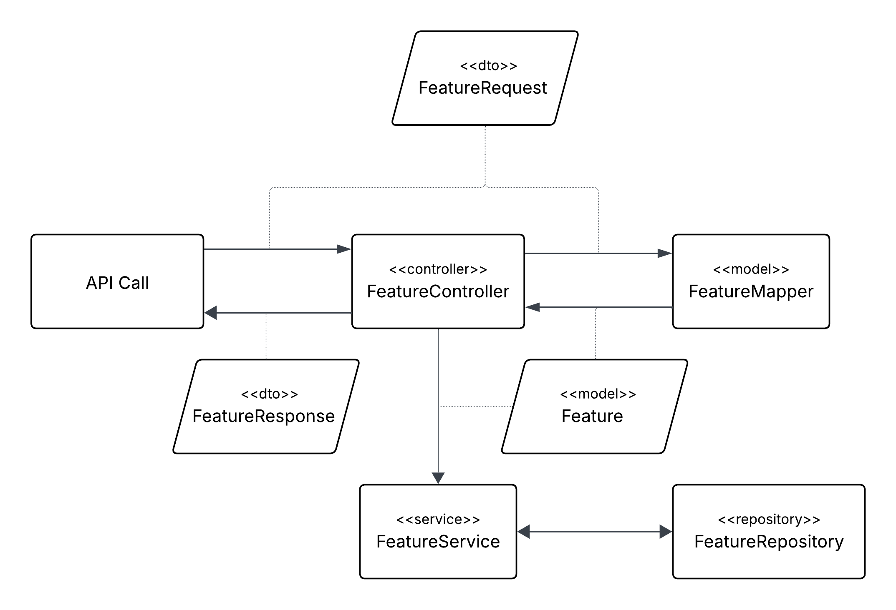

# Backend Code Structure and Data Flow

## Overview

This backend application is built using:

- **Spring Boot**
- **Java 21**
- **Maven** (dependency management)
- **MongoDB** (persistence layer)

The application follows a **feature-based modular structure**, meaning each business feature has its own directory (e.g. `user`, `feature`, `order`), and inside that, subpackages are used to organize layers such as controller, service, repository, etc.

---

## Package Responsibilities

Each feature (e.g. `feature`, `user`, etc.) contains the following subpackages:

### 🔹 `controller`
- **Purpose**: Handles communication with the frontend (API endpoints).
- **Framework**: Uses Spring Web (`@RestController`, `@RequestMapping`, etc.).
- **Naming**: Ends with `Controller` (e.g., `FeatureController.java`).
- **Input/Output**: Accepts `FeatureRequest` DTOs and returns `FeatureResponse` DTOs.

### 🔹 `dto`
- **Purpose**: Encapsulates data that comes **into** the API (`Request`) and goes **out** (`Response`).
- **Validation**: Input DTOs are validated using **Jakarta Bean Validation** (e.g., `@NotNull`, `@Size`).
- **Classes**:
  - `FeatureRequest`: Incoming data.
  - `FeatureResponse`: Outgoing data.

### 🔹 `model`
- **Purpose**: Internal domain representation of a feature.
- **Mapper**: Includes a `FeatureMapper` class for converting between DTOs and domain models.

### 🔹 `service`
- **Purpose**: Contains business logic and orchestrates between the model and repository layers.
- **Naming**: Ends with `Service` (e.g., `FeatureService.java`).
- **Call Source**: Called from the Controller layer.

### 🔹 `repository`
- **Purpose**: Data access layer, responsible for communicating with **MongoDB**.
- **Framework**: Uses Spring Data (`MongoRepository`).
- **Naming**: Ends with `Repository` (e.g., `FeatureRepository.java`).

---

### Visual Flow Overview

