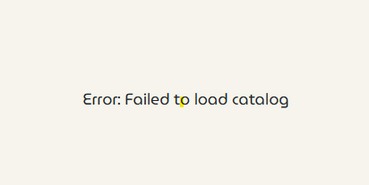

[[TC-02-DM-007](../../tests/TS-01_Metadata_managment/TS-DM-007#tc-02-dm-007-opening-datasets-catalog--no-datasets-available)] Test log 12-06-2025 11:18:48
---
**Step 1**: ❌ Failed: ,,Error: Failed to load catalog'' is displayed. 

**Steps to reproduce**:
- log in as ,,Metadata Manager''
- select ,,Go to Page'' button under ,,Data sets''

